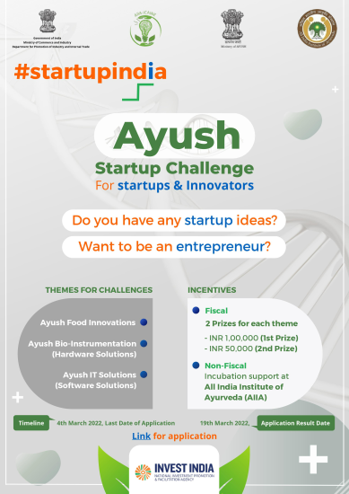

# StartUp_Ayush
StartUp Portal designed for Ministry of Ayush

->Building a collaborative platform and a dynamic environment for all the Stakeholders which includes startups, Investors, Government Agencies, Public users, Incubators and Accelerators.​
->The AYUSH Startup community will be united through virtual connections, mentorship, and opportunities for showcasing.​
->Abundant resources and informative guides will be available to support everyone on their entrepreneurial path within the AYUSH domain.

Technology yet to be implemented
->We create a personalized experience through our website for the stakeholders which is a never before technology by Ministry of AYUSH.​
->We will establish a Community Forum that fosters a sense of camaraderie, mutual assistance, and knowledge sharing among its members.​
->A user-friendly AI chatbot designed to simplify tasks for users.​

.jpg)

